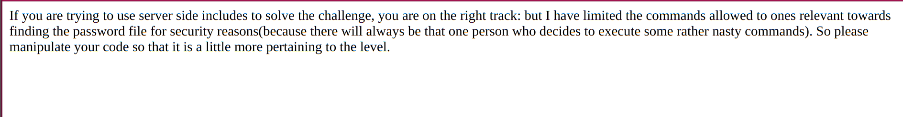

# Level 8

- we know the encrypted password file is stored in `/var/www/hackthissite.org/html/missions/basic/8/`
- okay now lets read the source code
- i tried doing some basic commands like `ls` and `cd`
- but then realised that it is in `php`
- so it is a server side language
- so we need to perform a server side injection
- if you don't know what it is [SSI](https://owasp.org/www-community/attacks/Server-Side_Includes_(SSI)_Injection)
- now lets try 	`<!--#exec cmd="cat /var/www/hackthissite.org/html/missions/basic/8/" -->`
- but i got an error
- 
- so lets try this `<!--#exec cmd="ls ../" -->`
- we will find a sus `.php` file
- now do `<!--#exec cmd="cat ../filename.php" -->`

- 7e23508d