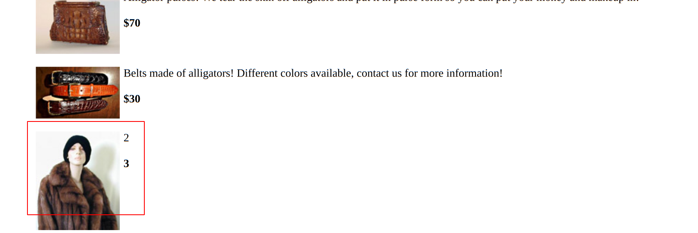

# Fischer's Animal Products

### So in this mission we need to get the email list of the customers from the database

URL : <https://www.hackthissite.org/missions/realistic/4/>

- I entered a real email address and it gave no errors.
- then i tried giving a blank email address, it threw an error stating the table we are storing the emails is, the `email`  table.
- now let's think of a sql injection.
- first we need to figure out the total number of existing tables in the database.
	- we can do this using the `ORDER BY` statement
	```sql
		https://www.hackthissite.org/missions/realistic/4/products.php?category=2 ORDER BY 1	
	```
	- here we need to keep changing the value of the `ORDER BY` a statement to find the number of tables
		- at `ORDER BY 5` the page doesn't load
		- so the number of ==coloumns is 4==
- now let's try 
```sql
	https://www.hackthissite.org/missions/realistic/4/products.php?category=2 UNION ALL SELECT 1,2,3,4
```
- we get something that is hidden 

- So mostly it is column 2 or 3
- now let's try 
```sql
	https://www.hackthissite.org/missions/realistic/4/products.php?category=2 UNION ALL SELECT null,null,*,null FROM email
```
	- here `*` means get everything from that column
	- and `null` is used when the value is unkown or missing
	- `email` is the table name we found out from the error
- aanddd we get all the emails!!
***
- now we have to message the emails to `SaveTheWhales`
- go back to the main site and click on your username `SaveTheWhales` and paste the emails and send.