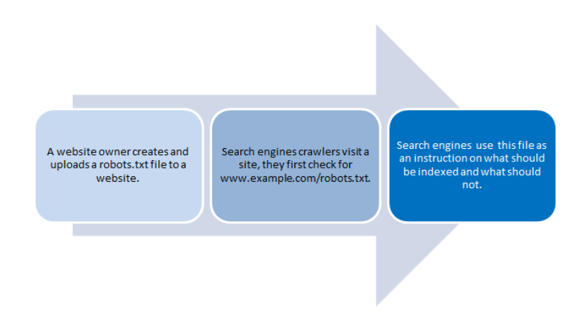
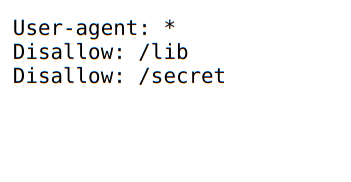
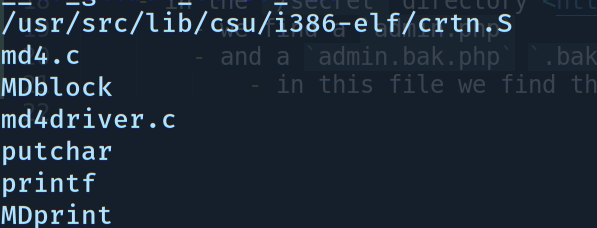

# Damn Telemarketers!

### We habe to get into their database and find tha password is encrypted

URL : <https://www.hackthissite.org/missions/realistic/5/>

- Let's start by reading the page source
- hmm... we find this commented `crawlers keep out of here`
	- this mostly indicates a `robots.txt` a page.
	 
	- this page tells the search engine bots which pages to index and which to not index
- now let's go to this `https://www.hackthissite.org/missions/realistic/5/robots.txt` 

	- this disallows 2 directories, namely: `/lib` and `/secret`
	- in the `/lib` directory <https://www.hackthissite.org/missions/realistic/5/lib>
		- we find a hash file, let's download it
		- let's run `strings hash` in the terminal, we find out that this is mostly a `MD4` hash.
		
	- in the `/secret` directory <https://www.hackthissite.org/missions/realistic/5/secret>
		- we find a `admin.php` 
		- and a `admin.bak.php` `.bak` is generally used to signify a backup copy of a file.
			- in this file we find the hash `6761912eb7be84e80f34511ff13b4cb0`, let's copy that.
- now time to crack the hash, let's go to [this website](https://crackstation.net/) and find the value for the hash.
- now go to the database site <https://www.hackthissite.org/missions/realistic/5/submit.html> and submit the value we got from the site.
- DONE!!
