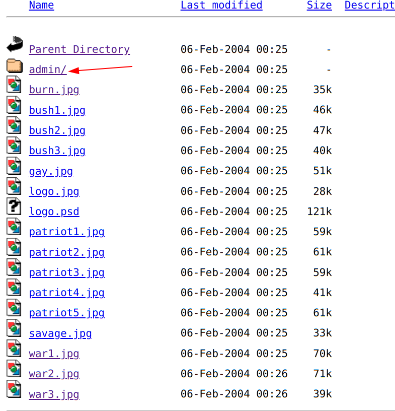
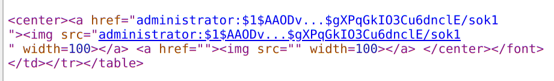
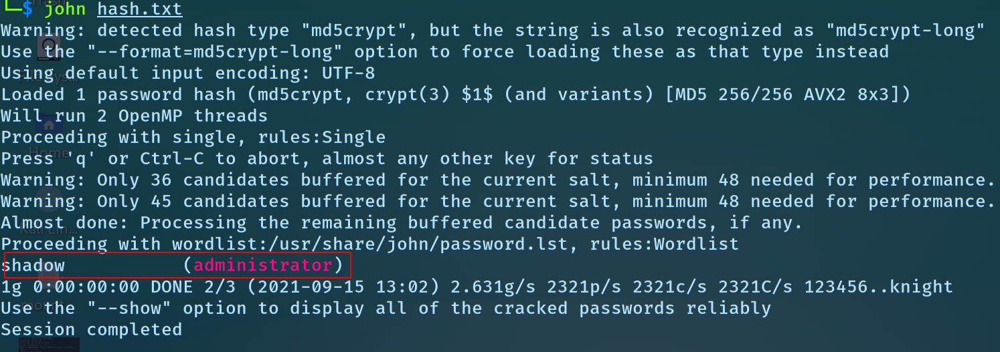

# What's Right For America

### So we need to get the administrative access to the given website, which is in a hidden directory.

URL : <https://www.hackthissite.org/missions/realistic/7/>

- Let's start by reading the soure code of the websites
- we can see a directory by the name `images`
- let's go check that out <https://www.hackthissite.org/missions/realistic/7/images/>
	- we have found an admin folder!
	
- let's go to the `/images/admin` directory, we are presented with a pop up which is asking us for a username and password.
- so now we have to find the password.
- and when we open patriotism (or any other) page on the website we get something like this:
	- 
	- i.e this link fetches a file 
	- so to get the password file, we know apache stores passwords in the `.htpasswd` file
	- so let's get that <https://www.hackthissite.org/missions/realistic/7/showimages.php?file=/images/admin/.htpasswd>
	- and nothing will be seen, so let's view the source code.
	- we find this, a username and a hashed password
	`administrator:$1$AAODv...$gXPqGkIO3Cu6dnclE/sok1` save this in a file.
	
- now let's run johntheripper `john` to crack the hash.
	- `john /path/to/the/file`
	
- we got the password!! 