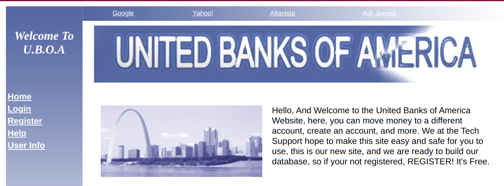
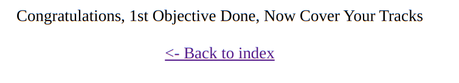
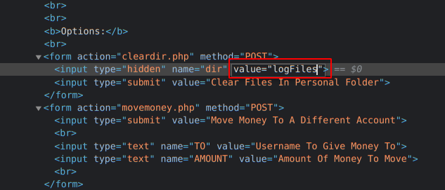

# United Banks Of America

**We have to** 
1. Find the account of Gary Hunter (I don't know his account name).
2. Move the $10,000,000 into the account dropCash.
3. Clear The Logs, They're held in the folder 'logFiles'.

URL : <https://www.hackthissite.org/missions/realistic/8/>

- Let's first read the source code, hmm nothing interesting here.
- now let's find a way to get Gary Hunter's username.
- let's try a sql injection
- go to the [user-info page](https://www.hackthissite.org/missions/realistic/8/search.php)
- and let's try a basic SQLi `' OR 1=1 --`
- this returns all the info of the users and looking through it we can find the account we are looking for
	- username : `GaryWilliamHunter`
	- password : `-- $$$$$ --`
	- ~~1. Find the account of Gary Hunter (I don't know his account name)~~
- i tried logging in with the above but it was wrong, so mostly it is not his password, but it might be his account description
***
- ok now we have to find a way to get access to GaryWilliamHunter's account
- we can try this by javscript cookie stealing
- to do that:
1. let's register an account and login into it
2. now `ctrl+shift+i` and go to the cookies section
3. we can find two important values : `accountPassword` and `accountUsername`
4. we have to change this to `accountUsername = GaryWilliamHunter` and `accountPassword = -- $$$$$ --` 
- now that we have changes this the website thinks we are logged in as Gary
- let's transfer the money to dropCash. ~~2. Move the $10,000,000 into the account dropCash~~

***
- now to clear the log files inspect the button `clear files in personal folder` and change the value to `logFiles`

~~3. Clear The Logs, They're held in the folder 'logFiles'~~

#### COMPLETED!