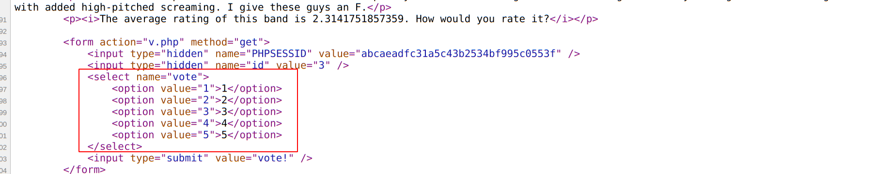
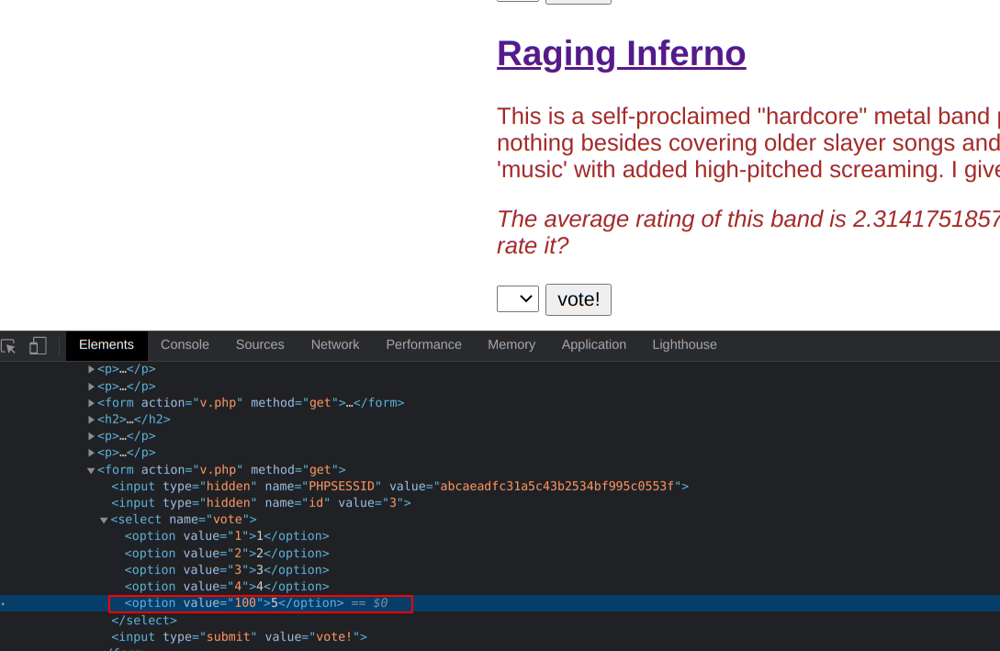

# Uncle Arnold's Local Band Review

### So we have to hack into the given website and put Raging Inferno at the top of the list. 

URL : <https://www.hackthissite.org/missions/realistic/1/>

- now, for raging inferno to get the highest vote we have to somehow increase their votes
- let's start by reading the page source 
- nothing very interisting there, but we can see how the votes are being entered

- now we to change the value of the vote
- by inspecting the element and changing the value
- 
- SOLVED!